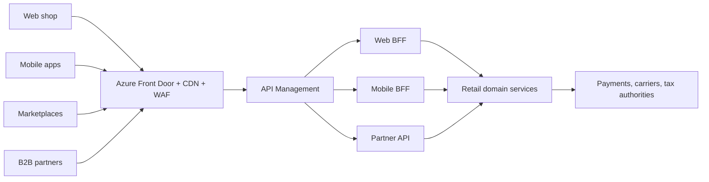
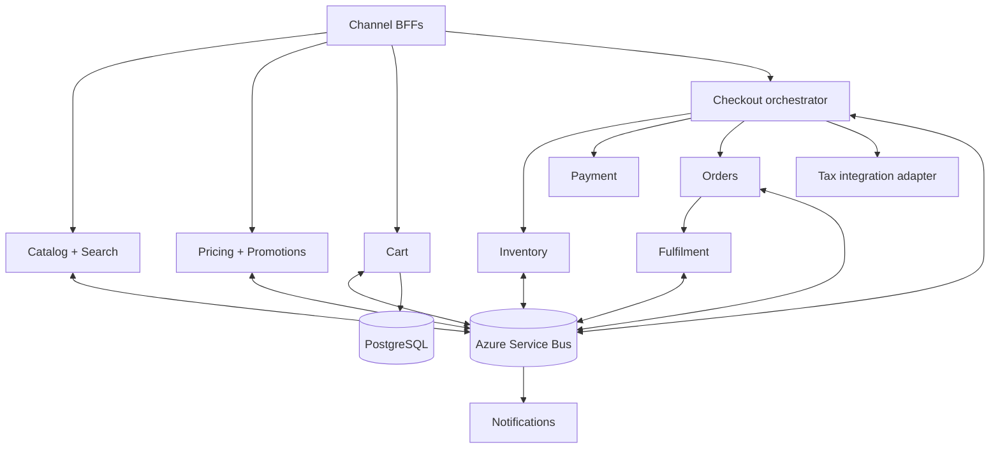
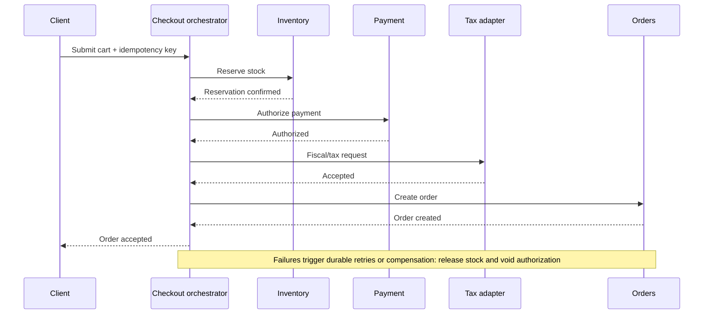

# Global retail platform — architecture vision

## Executive recommendation

Start with independently owned domain boundaries and deploy the first customer journey as a modular system. Extract a boundary only when its scaling profile, release cadence, reliability isolation, or team ownership warrants the operational cost. The submitted cart is one extraction-ready vertical slice, not a claim that the complete global platform should be one process.

For the first production deployment, use Azure Container Apps, Azure Database for PostgreSQL, Service Bus, Front Door/WAF, API Management, Key Vault, and Application Insights. Add Azure Cache for Redis only for access patterns that benefit from shared low-latency state, such as projections, sessions, distributed rate limiting, or partner throttling. Move selected workloads to AKS only when networking, workload density, sidecars, or platform control justify a Kubernetes team.

## System context

The edge terminates TLS, absorbs volumetric attacks, caches public assets, applies coarse rate limits, and routes to regional API gateways. BFFs shape channel-specific responses without leaking internal service topology.

## Main technology choices

| Concern | Selected technology | Why it fits | Main trade-off |
|---|---|---|---|
| Service runtime | .NET 10, C#, ASP.NET Core | High-throughput async APIs, strong type system, mature diagnostics and long-term Microsoft ecosystem alignment | Higher baseline container size than minimal native runtimes |
| Web client | React, TypeScript, Vite | Channel-focused UI, fast builds, broad ecosystem and contract-friendly types | Client state and API compatibility require discipline |
| Transactional data | PostgreSQL with EF Core | ACID cart updates, optimistic concurrency, decimal money and portable relational operations | Single-writer scaling eventually needs partitioning or another store |
| Hot data | CDN plus targeted Redis projections where justified | Low-latency reads for immutable assets and explicitly designed hot data while PostgreSQL stays authoritative | Shared caches require invalidation, stale-data handling and clear ownership |
| Async communication | Azure Service Bus with transactional outbox | Absorbs bursts, supports durable real-time propagation and decouples domain releases | Eventual consistency, duplicates and dead-letter operations must be designed explicitly |
| Edge and API | Azure Front Door, WAF and API Management | Global routing, CDN, abuse protection, quotas and channel governance | Platform cost and Azure coupling |
| Initial compute | Azure Container Apps | Managed scaling with less operational load than Kubernetes | Less low-level control than AKS |
| Observability | OpenTelemetry with Azure Monitor/Application Insights | Vendor-neutral instrumentation, correlated traces, metrics and structured logs | Telemetry volume and cardinality require cost controls |

“Real time” means low-latency event propagation where the business can tolerate eventual consistency, not synchronous coupling everywhere. Inventory, price, order and notification changes publish durable events through Service Bus. Decisions that must be authoritative for the current request—cart version checks, price validation at checkout, stock reservation and payment authorization—remain synchronous and strongly consistent within their owning service.

## Container view and responsibilities

| Component | Primary responsibility | Consistency/availability choice |
|---|---|---|
| Catalog/Search | Product content, taxonomy, localized projections | Eventual read projections; availability preferred |
| Pricing | Authoritative prices, promotions and currency rules | Strong per calculation; price revalidated at checkout |
| Inventory | Stock ledger, reservations and releases | Strong per SKU/location reservation |
| Cart | Intent to purchase and price snapshots | Strong within one cart; executable slice uses PostgreSQL directly |
| Checkout | Coordinates reservation, payment, tax and order saga | Durable workflow; compensating actions |
| Orders | Immutable commercial record and status lifecycle | Strong writes, append-only audit history |
| Payment | Provider token exchange, authorization and capture | PCI boundary; no card data stored by retail services |
| Integration adapters | Translate partner contracts and isolate failures | Idempotent, queued and independently throttled |

Each domain owns its database. Cross-domain database access is forbidden. Immediate user decisions use versioned HTTPS APIs; state propagation and long-running work use events. Schemas are versioned and consumers tolerate additive fields.

## Critical workflows

### Cart write

The client sends the opaque cart capability, expected version, and idempotency key. The Cart service authorizes the capability using a constant-time hash comparison, validates invariants, updates PostgreSQL under optimistic concurrency, and records the idempotency key in the same transaction. A stale version returns `409`; a repeated idempotency key returns the already-applied state.

### Checkout saga

There is no distributed ACID transaction. The orchestrator persists each transition. Commands and events use stable message IDs, idempotent consumers, retry with jitter, dead-letter queues, and a transactional outbox so a domain write and event publication cannot diverge.

## Scaling and resilience

- Cache immutable catalog media at the CDN and hot catalog/pricing projections near compute. Never cache authorization decisions in shared public caches.
- Scale stateless API replicas on CPU, latency, request rate, and Service Bus depth. Apply load shedding before thread/connection pools saturate.
- Keep cart writes single-region per cart using deterministic home-region routing. Partition PostgreSQL by tenant/region or hash of cart ID when write volume requires it; use replicas only for safe stale reads.
- Bound database connections, use short transactions, and index cart/item/idempotency lookup paths. Add Redis only where a measured projection, session, distributed-rate-limit, or hot-data pattern avoids source-of-truth work safely.
- Isolate partner calls with timeouts, bulkheads and circuit breakers. Queue tax and marketplace work where the legal/user workflow permits it.
- Use active-active edge routing with regional application stacks. Maintain automated backups and point-in-time restore. Initial targets: RPO <= 5 minutes and RTO <= 30 minutes, validated by recovery exercises.

Millions of daily users do not alone justify every service or AKS. Measure peak requests, write ratios, payloads, latency objectives and regional distribution, then load-test at expected peak plus failure headroom.

## Security and authentication

- Customers authenticate through OpenID Connect/OAuth 2.1 with Authorization Code + PKCE; services validate short-lived audience-scoped JWTs. Workloads use managed identities and least-privilege RBAC.
- Anonymous carts use 256-bit opaque capability tokens. Only SHA-256 hashes are stored. Tokens stay in secure client storage, are never logged, rotate on ownership changes, and are exchanged/merged after sign-in.
- APIM and services enforce object-level authorization, schema limits, quotas and rate limits. Administrative APIs require phishing-resistant MFA and stronger scopes.
- TLS protects all transit; Azure-managed encryption protects storage; sensitive fields use application-level encryption where threat modelling requires it. Secrets and certificates live in Key Vault and rotate automatically.
- Payment pages use provider-hosted fields/tokenization to reduce PCI scope. Logs and events exclude credentials, tokens, full payment data and unnecessary personal data.
- Software supply-chain controls include locked dependencies, vulnerability scanning, signed immutable images, SBOMs, protected environments and auditable deployments.

See [Threat model](threat-model.md) for concrete abuse cases and mitigations.

## External integrations

Every tax authority, payment provider, carrier, marketplace and B2B protocol sits behind a domain-owned port and anti-corruption adapter. Adapters translate vendor schemas into canonical internal contracts, attach correlation and idempotency identifiers, enforce per-partner throttles, store audit references, and quarantine poison messages. Vendor outages therefore degrade a bounded workflow rather than consuming the platform's request pool.

Tax/fiscal calls vary by country. Synchronous issuance is used only where law requires it; otherwise the order workflow records a pending fiscal state and processes via a durable queue. Manual replay tooling must preserve the original idempotency key and audit trail.

## Observability and operations

OpenTelemetry supplies W3C-correlated traces, RED metrics, runtime/database telemetry, and structured logs. Production exports OTLP to Azure Monitor/Application Insights; `/metrics` supports local Prometheus-compatible inspection.

| Signal | Objective / alert example |
|---|---|
| Cart availability | 99.95% monthly; page on multi-window error-budget burn |
| Cart mutation latency | p95 < 250 ms in-region; alert on sustained breach |
| Checkout success | Alert on business success-rate drop, not only HTTP 500s |
| Queue health | Alert on oldest-message age and dead-letter growth |
| Dependencies | PostgreSQL saturation, connection wait, cache/projection errors where deployed, partner circuit state |

`/health/live` only answers whether the process can serve; orchestrators restart on failure. `/health/ready` includes required dependencies and removes an instance from routing. Optional caches are excluded from readiness unless a future feature makes them mandatory for serving correct responses. Runbooks link every page to dashboards, recent deployments, rollback, ownership, and customer impact.

## Delivery, CI/CD and branching

Use trunk-based development: short-lived `feature/*` branches, reviewed pull requests, protected `main`, mandatory build/test/security checks, conventional commits and signed release tags. Two cross-functional teams own explicit domain boundaries and share platform standards rather than shared databases.

| Team | Initial ownership | Collaboration boundary |
|---|---|---|
| Customer Experience | Web/mobile BFFs, Catalog, Search, Pricing and Cart | Publishes customer-intent and catalog/price events; consumes inventory availability projections |
| Transaction & Operations | Checkout, Inventory, Orders, Payments, Fulfilment and external adapters | Owns the purchasing saga and authoritative commercial records |

Both teams include product, frontend, backend, QA and operational capability. Shared platform standards cover identity, telemetry, event contracts, CI templates and cloud guardrails; they do not create a shared application database or a central delivery bottleneck.

CI restores locked dependencies, compiles with warnings as errors, runs domain and container-backed integration tests, tests/builds the React client, audits dependencies, and builds immutable images tagged by commit SHA. CD promotes the same image through environments. EF migrations run as a separately observed job before compatible application rollout. Production begins with canary traffic, automated smoke/SLO gates, then progressive promotion; rollback points traffic to the preceding image. Database changes follow expand/migrate/contract so rollback remains possible.

## Alternatives and trade-offs

- **Modular first versus microservices immediately:** modular delivery reduces distributed failure modes and accelerates two teams; extraction provides independent scaling later. It requires strict module boundaries to avoid a lasting big ball of mud.
- **PostgreSQL versus Redis/Dynamo-style cart primary:** PostgreSQL provides transactions, durable idempotency and familiar operations. A globally distributed key-value store can eventually reduce regional write latency but complicates queries, consistency and migration.
- **Service Bus versus synchronous-only:** messaging absorbs bursts and decouples releases, but introduces eventual consistency, duplicates, ordering constraints and operational tooling.
- **Container Apps versus AKS:** Container Apps minimizes platform overhead for the initial product. AKS offers deeper scheduling/network control at the cost of a dedicated platform capability.

## Phased roadmap

1. **Cart vertical slice:** establish domain conventions, delivery pipeline, telemetry, PostgreSQL and the demo UI.
2. **Purchasing path:** integrate authoritative pricing, inventory reservation, checkout saga, provider-tokenized payment and Orders.
3. **Channels and integrations:** introduce BFFs, marketplace/B2B adapters, country-specific tax adapters, notification projections and operational replay tools.
4. **Global hardening:** measured partitioning, regional placement, capacity/load tests, chaos and recovery exercises, canary automation, SLO governance and cost controls.

## Assumptions requiring discovery

Peak RPS by region, catalog size, write/read ratio, tax jurisdictions, data residency, marketplace SLAs, recovery objectives and PCI boundary must be validated with stakeholders. The values above are explicit starting hypotheses, not hidden facts.
